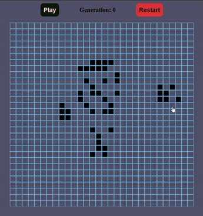

# Automaton

I know it has been implemented a gazillion times, and yet I've implemented it for the gazillionth and first time. Why? Because it's fun!


## Installation

Clone the repository

```bash
  git clone https://github.com/plutos-pole/automaton.git
  npm install
  cd automaton
  npm run dev
```
    
## Running Tests

To run tests, run the following command

```bash
  npm run test
```

## Screenshots


